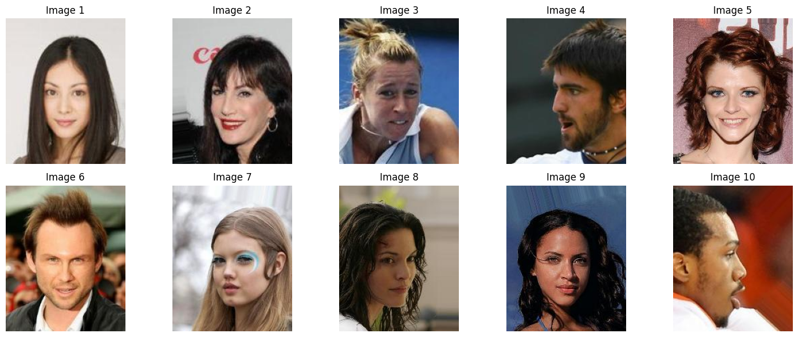
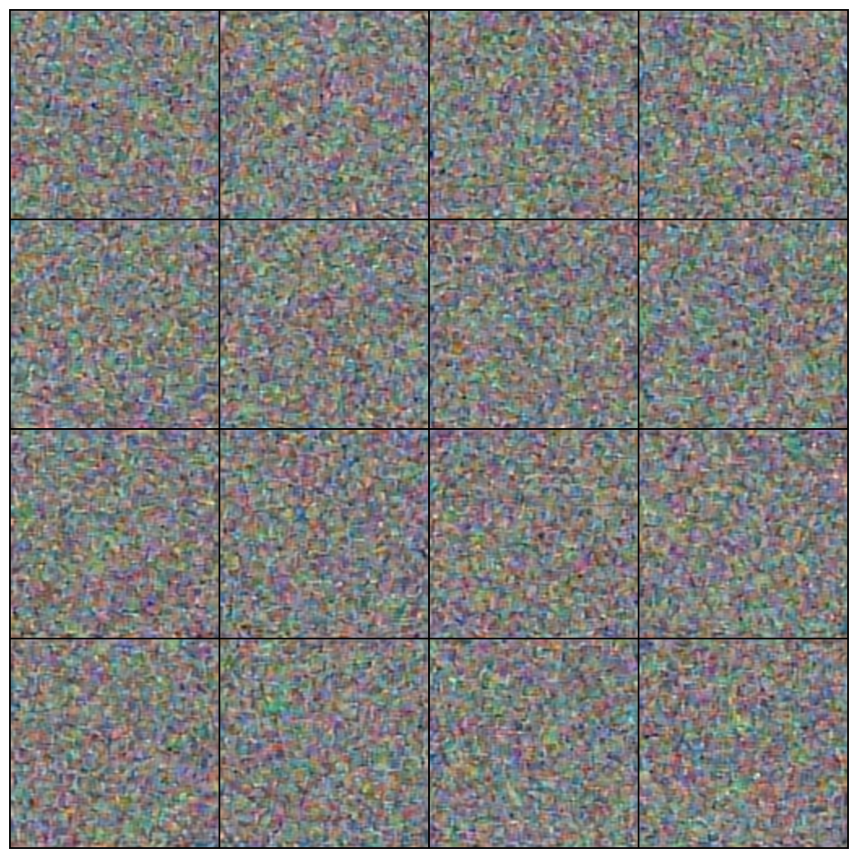

# Unet_DeepLearningProject: Diffusion Models for Image Generation using U-Net on CelebA Dataset

## Overview
This project, **Unet_DeepLearningProject**, explores the application of **diffusion models** for image generation, specifically using the **CelebA dataset** and a **U-Net** architecture. The goal is to generate high-quality face images from noise through the reverse diffusion process. The diffusion model, inspired by **Score-Based Generative Models**, is integrated with U-Net to learn how to reverse the added noise and generate realistic images.

### Key Features:
- Implementation of a **diffusion model** with **U-Net** for image generation.
- Training and evaluation on the **CelebA dataset**, a large collection of celebrity face images.
- Use of **mixed-precision training** for efficient training.
- Generation of images from random noise using the trained model.

### Created by: **AnaisBoughanem**

## Project Structure

The project consists of the following files:

- **README.md**: This file, providing an overview of the project.
- **REPORT.md**: A detailed report explaining the theory behind U-Net and diffusion models and their application in image generation.
- **src.ipynb**: A Jupyter notebook containing the implementation of the diffusion model, U-Net architecture, and the training loop.

## Installation

To set up the environment for this project, please follow the steps below:

1. **Clone the repository**:
    ```bash
    git clone https://github.com/AnaisBou/Unet_DeepLearningProject.git
    cd Unet_DeepLearningProject
    ```

2. **Install dependencies**:
    The project requires the following Python libraries:
    - `torch`
    - `torchvision`
    - `PIL`
    - `tqdm`
    - `matplotlib`
    - `numpy`

3. **Download the CelebA dataset**:
    The CelebA dataset can be downloaded from [here](https://mmlab.ie.cuhk.edu.hk/projects/CelebA.html). Make sure to place the dataset in the appropriate directory and update the path in the code.

## Dataset

### CelebA Dataset

The CelebA dataset consists of 20,599 celebrity images, each annotated with 40 attribute labels. These images are used for training the diffusion model to generate new face images.

**Example images from CelebA:**



For this project, the images were resized to 256x256 pixels for training.

## Training

The training of the diffusion model with U-Net involves the following key steps:

1. **Preprocessing the CelebA images**: Resize the images to 256x256 pixels and normalize pixel values to a range suitable for neural network training.
2. **Training the Diffusion Model**: The model is trained for 10 epochs using a **Mean Squared Error (MSE)** loss function. The optimizer used is **Adam**, and **mixed-precision training** is employed to reduce computational overhead.
3. **Saving the Model**: The trained model is saved periodically to allow for checkpointing.

To run the training, execute the notebook `src.ipynb` and follow the steps in the notebook cells.

## Results

### Generated Images

Below are some examples of images generated by the trained diffusion model after 10 epochs of training:

**Generated Images:**



As shown, the model was unable to generate clear or recognizable faces. Instead, the generated images appear as pixelated noise without any clear structure, indicating that the model struggled to reverse the added noise effectively. This suggests that the current architecture and training setup were insufficient for achieving meaningful results.

### Challenges Encountered

1. **Difficulty in Implementing the Diffusion Model**:
   Implementing a working diffusion model integrated with U-Net was far more challenging than expected. Despite following theoretical resources and tutorials, the results did not meet expectations. The model was unable to generate coherent images, and the output appeared pixelated rather than realistic. Fine-tuning diffusion steps and adjusting the architecture didn’t yield the desired results.

2. **Inadequate Image Quality**:
   The generated images are highly pixelated, and there is no clear pattern resembling faces or any recognizable features. This indicates that the diffusion process, combined with U-Net, wasn't successful in learning how to generate realistic images from noise.

3. **Training Instability**:
   The training process exhibited instability, especially in the initial epochs. Despite efforts to adjust hyperparameters (such as learning rate and number of diffusion steps), the model failed to converge to generate sharper or more meaningful images.

4. **Lack of Clear Faces in Generated Output**:
   The primary goal of this project was to generate faces from the CelebA dataset, but the results show that the model struggles with producing structured, human-like faces. The output is more of random noise, with no discernible patterns or features resembling actual faces.

5. **Model and Dataset Limitations**:
   The CelebA dataset is highly complex and includes diverse images, making it challenging for the model to learn the underlying patterns effectively. The inability of the model to generate faces may also be due to insufficient training, inadequate architecture, or a mismatch between the model's complexity and the dataset's characteristics.

### Conclusion

While the project successfully integrated the diffusion model with U-Net, the generated images do not resemble faces and appear as random pixelated noise. The challenges encountered include difficulties in tuning the model and training it to generate realistic images. The results highlight that further experimentation, such as adjusting the diffusion steps or exploring different network architectures, is needed to improve image quality and obtain meaningful results.

### Future Work

Several areas can be explored to improve the results:
- **Hyperparameter Tuning**: Further experimentation with the number of diffusion steps, noise schedules, and learning rates could improve model stability and image quality.
- **Architecture Adjustments**: Trying different U-Net variants or other neural network architectures (e.g., GANs) might be beneficial in generating clearer, more realistic images.
- **Extended Training**: Training the model for more epochs or using a larger batch size may help in learning better representations of face images.
- **Alternative Models**: Explore using other generative models like GANs (Generative Adversarial Networks), which are often more effective in generating high-quality images.

## References

- **U-Net Paper**: [U-Net: Convolutional Networks for Biomedical Image Segmentation](https://arxiv.org/abs/1505.04597)
- **Score-Based Generative Modeling Paper**: [Score-Based Generative Modeling through Stochastic Differential Equations](https://arxiv.org/abs/2011.13456)
- **Denoising Diffusion Probabilistic Models**: [Denoising Diffusion Probabilistic Models](https://arxiv.org/abs/2006.11239)
- **CelebA Dataset**: [CelebA Dataset](https://mmlab.ie.cuhk.edu.hk/projects/CelebA.html)
