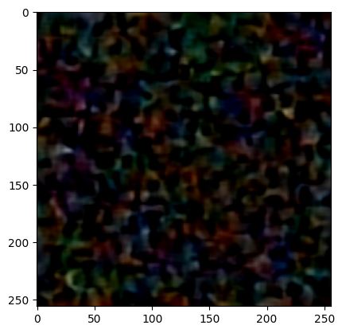

# Report: Understanding and Implementing Diffusion Models for Image Generation using U-Net

## 1. Introduction
This report outlines the implementation of a **diffusion model** for image generation, leveraging the **U-Net** architecture, specifically applied to the **CelebA** dataset. Diffusion models have gained attention in recent years for their ability to generate high-quality images through a forward and reverse noise process. In this project, I attempted to generate realistic faces by training a U-Net model to reverse the diffusion process. Unfortunately, the generated images did not meet the desired quality standards, and further improvements are necessary.

## 2. Background

### 2.1. U-Net Architecture
U-Net is an architecture originally developed for biomedical image segmentation and has since been widely applied to image generation and restoration tasks. It consists of an **encoder-decoder** structure:
- **Encoder**: Convolutional layers that reduce spatial dimensions while increasing feature depth.
- **Decoder**: Symmetric upsampling layers that reconstruct the image, assisted by **skip connections** from the encoder to maintain spatial information.

In this context, U-Net serves as the core **denoising network** in the reverse diffusion process, helping to convert noisy images back into cleaner images.

### 2.2. Diffusion Models
Diffusion models generate data by simulating a process of adding noise to an image and learning to reverse that noise through a learned model. The forward process gradually adds Gaussian noise to an image, while the reverse process, learned by the model, aims to recover the original clean image.

- **Forward Process**: A series of noise additions transforms the clean image into pure noise.
- **Reverse Process**: The model learns to reverse the noisy process, generating clean images from noisy inputs.

The U-Net architecture plays a key role in the reverse diffusion process, as it learns to denoise images step-by-step.

### 2.3. CelebA Dataset
The **CelebA dataset** consists of over 200,000 images of celebrity faces, each annotated with 40 attribute labels. This dataset is used to train the model to generate realistic human faces based on the learned distribution of celebrity images.

## 3. Methodology

### 3.1. Dataset Preprocessing
The CelebA dataset was resized to **256x256 pixels** to standardize the input size for the model. The pixel values were normalized to a suitable range for neural network training. This step ensures that the input images are uniformly sized and their pixel values are within a range that the model can learn effectively.

### 3.2. Model Architecture
The core of the diffusion model consists of two key parts:
1. **UNetBlock**: The building block of U-Net, which includes convolutional layers followed by dropout layers.
2. **Diffusion Step**: A module that adds Gaussian noise to the image to simulate the forward diffusion process.

The architecture also includes downsampling (through convolutional layers) and upsampling (through transpose convolutions) operations, with skip connections to retain important spatial information.

### 3.3. Training the Diffusion Model
The model was trained to reverse the diffusion process, learning to generate images from noisy inputs. The Mean Squared Error (MSE) loss function was used, and the optimizer employed was Adam. **Mixed-precision training** was used for better efficiency during training.

### 3.4. Evaluation
After training, the model was evaluated by generating images from random noise and comparing them to real images from the CelebA dataset. However, the results were not satisfactory, and the generated images were highly pixelated and lacked fine details.

## 4. Results

### 4.1. Generated Images
The images generated after 10 epochs of training were examined. Unfortunately, the results were far from promising, with the images being more pixelated than realistic. The faces generated lacked detail and clarity, showing that the model had not effectively learned how to reverse the diffusion process to produce clean and realistic images.

#### Example Generated Image:

### 4.2. Challenges and Solutions
1. **Training Stability**: Early in the training, there were signs of instability, including oscillations in the loss curve. This instability was mitigated somewhat by using **mixed-precision training**, but the overall results still did not meet expectations.

2. **Quality of Generated Images**: The images generated were pixelated and lacked detail. This could be due to:
   - An insufficient number of diffusion steps.
   - An overly simplistic noise schedule.
   - A need for more advanced architectures or fine-tuning the model's parameters.

3. **Computational Requirements**: Given the complexity of training a diffusion model, running the model on a **GPU** was essential to reduce training time and allow for efficient computation. However, even with GPU support, the model did not achieve the expected performance.

4. **Model Limitations**: Despite implementing a basic U-Net architecture, the model was unable to produce high-quality, sharp images. This suggests that either the model architecture or training process needs refinement.

### 4.3. Analysis of Model Performance
Although the model was able to learn some aspects of the diffusion process, the generated images still lacked quality. Several factors could be contributing to this failure:
- **Insufficient Diffusion Steps**: A higher number of diffusion steps could allow the model more opportunities to denoise and refine the generated images.
- **Noise Schedule**: The noise schedule might not have been optimal, as a better schedule could allow the model to reverse noise more effectively.
- **Architectural Adjustments**: The U-Net architecture might not have been deep or complex enough to capture the fine-grained details required for high-quality image generation.

## 5. Conclusion
This implementation of a diffusion model using U-Net for image generation failed to produce the expected results. While the model was able to partially learn the reverse diffusion process, the generated images were pixelated and lacked the necessary sharpness and clarity. The lack of satisfactory results highlights the complexity of training diffusion models for image generation and the importance of fine-tuning various aspects, including the diffusion steps, model architecture, and training process.

### 5.1. Future Work
To improve the model's performance, the following steps are recommended:
- **Increase the Number of Diffusion Steps**: A higher number of diffusion steps may improve the model's ability to denoise images.
- **Optimize the Noise Schedule**: Experiment with different noise schedules (e.g., learned or cosine schedules) to improve the reverse diffusion process.
- **Improve the U-Net Architecture**: Experiment with deeper U-Net models or explore using conditional U-Net architectures to generate more detailed and higher-quality images.
- **Longer Training Duration**: Extend the training duration to allow the model to converge better.
- **Advanced Techniques**: Implement advanced generative techniques such as adversarial loss or perceptual loss to improve image quality.

## 6. References
- [U-Net Paper](https://arxiv.org/abs/1505.04597)
- [Score-Based Generative Modeling Paper](https://arxiv.org/abs/2011.13456)
- [Denoising Diffusion Probabilistic Models](https://arxiv.org/abs/2006.11239)
